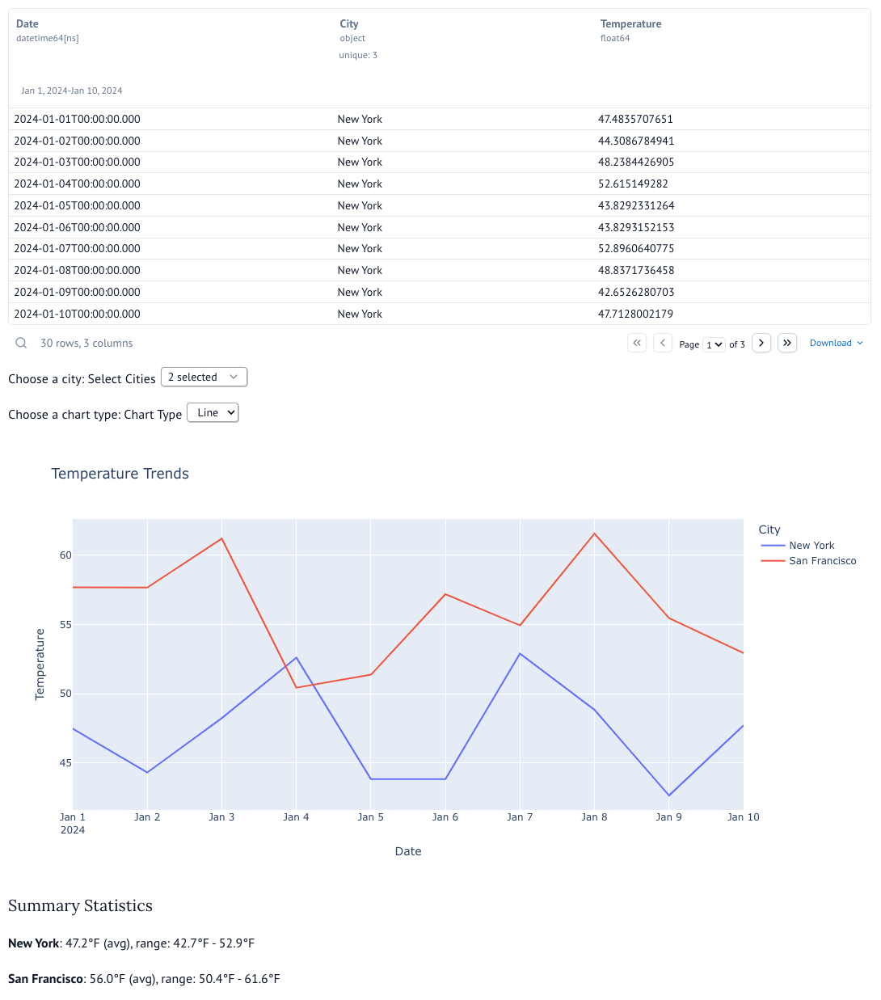

# Marimo Dashboard Demo


An interactive dashboard built with [marimo](https://github.com/marimo-team/marimo), demonstrating real-time data visualization and analysis capabilities.

📝 Read the full tutorial: [Marimo: A Modern Notebook for Reproducible Data Science](https://codecut.ai/marimo-a-modern-notebook-for-reproducible-data-science/)



## Features

- 📊 Interactive temperature visualization across multiple cities
- 🔄 Real-time data updates with user selections
- 📈 Multiple chart types (Line and Bar)
- 📑 Summary statistics for selected cities

## Live Demo

Visit the live dashboard at: https://khuyentran1401.github.io/marimo-dashboard-demo/

## Local Development

### Prerequisites

- Python 3.11+
- [uv](https://github.com/astral-sh/uv) (recommended) or pip

### Installation

1. Clone the repository:

```bash
git clone https://github.com/khuyentran1401/marimo_dashboard.git
cd marimo_dashboard
```

2. Install dependencies with uv:
```bash
uv venv
source .venv/bin/activate  # On Windows: .venv\Scripts\activate
uv add marimo
```

### Running the Dashboard

Start the marimo notebook:
```bash
marimo edit dashboard.py --sandbox
```

The dashboard will open in your default web browser.

## Project Structure

- `dashboard.py` - Main marimo notebook containing the dashboard code
- `.github/workflows/deploy.yml` - GitHub Actions workflow for automatic deployment

## Contributing

1. Fork the repository
2. Create a new branch for your feature
3. Make your changes
4. Submit a pull request

## License

MIT License - feel free to use this demo for your own projects!